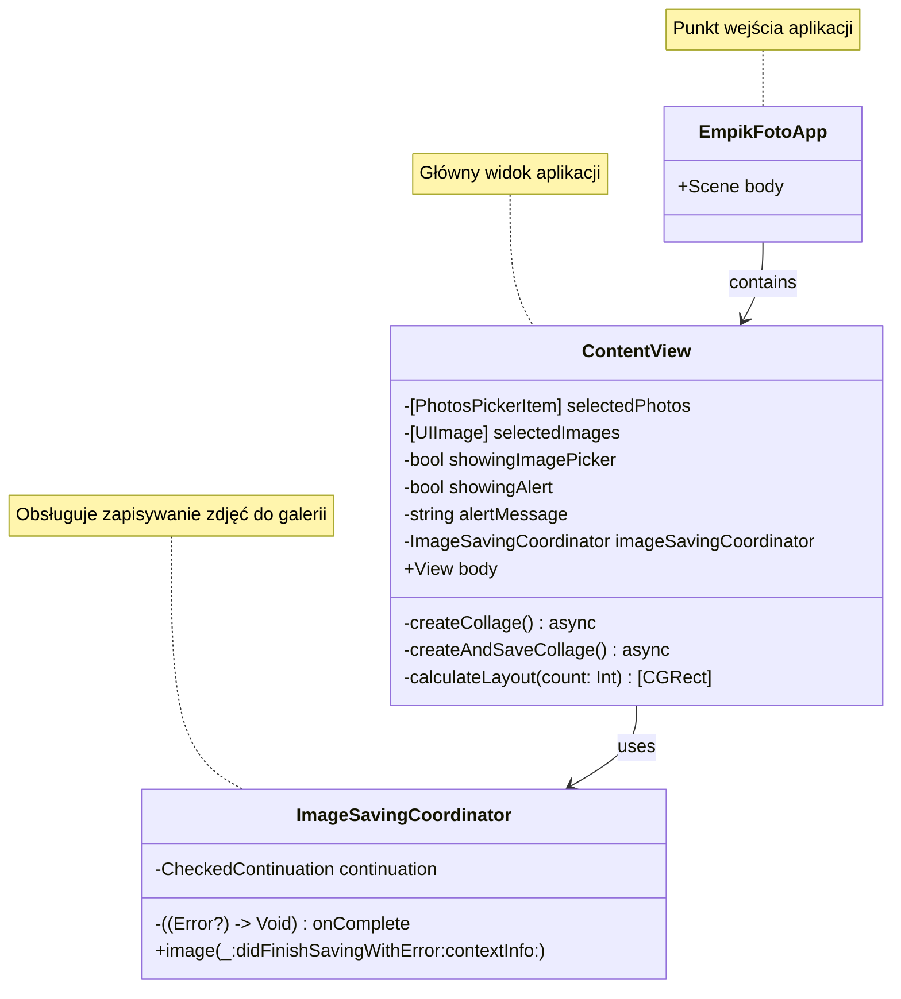

# EmpikFoto

Aplikacja iOS do tworzenia kolaży ze zdjęć. Umożliwia wybór do 6 zdjęć i automatyczne utworzenie z nich kolażu, który następnie zostaje zapisany w galerii urządzenia.

## Architektura

## Funkcjonalności

- Wybór do 6 zdjęć z galerii
- Automatyczne tworzenie kolażu
- Zapisywanie kolażu do galerii
- Obsługa uprawnień do galerii
- Responsywny interfejs użytkownika

## Wymagania

- iOS 17.0+
- Xcode 15.0+
- Swift 5.9+

## Instalacja

1. Sklonuj repozytorium
2. Zainstaluj XcodeGen: `brew install xcodegen`
3. Wygeneruj projekt: `xcodegen generate`
4. Otwórz `EmpikFoto.xcodeproj`
5. Zbuduj i uruchom aplikację

## Użycie

1. Uruchom aplikację
2. Wybierz zdjęcia używając przycisku "Dodaj zdjęcie"
3. Po wybraniu zdjęć kliknij "Utwórz kolaż"
4. Kolaż zostanie zapisany w galerii urządzenia

## Licencja

Copyright © 2025 zespol-it.pl. Wszelkie prawa zastrzeżone.